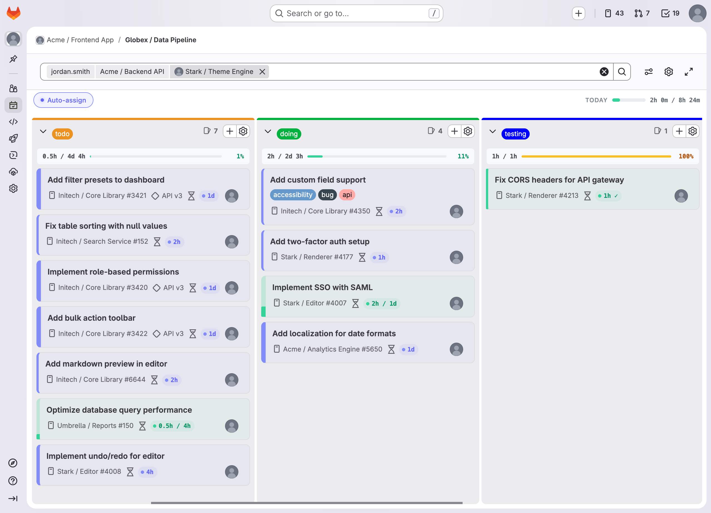
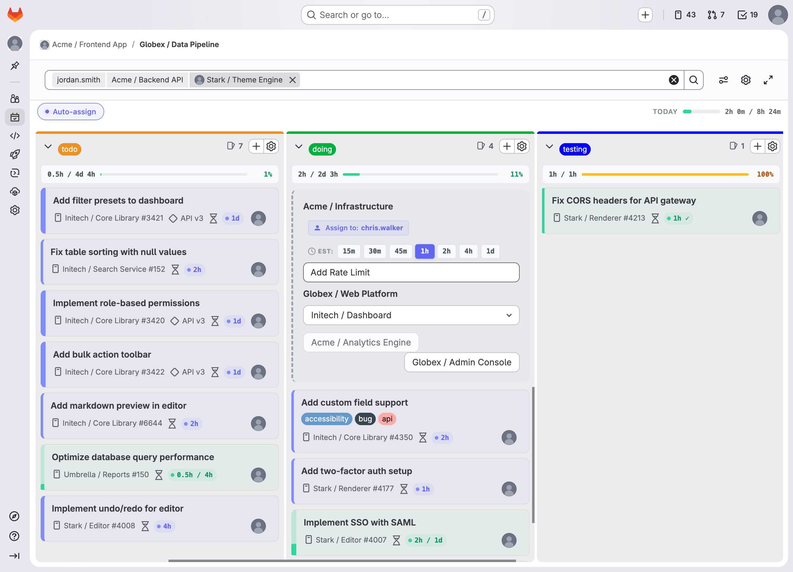
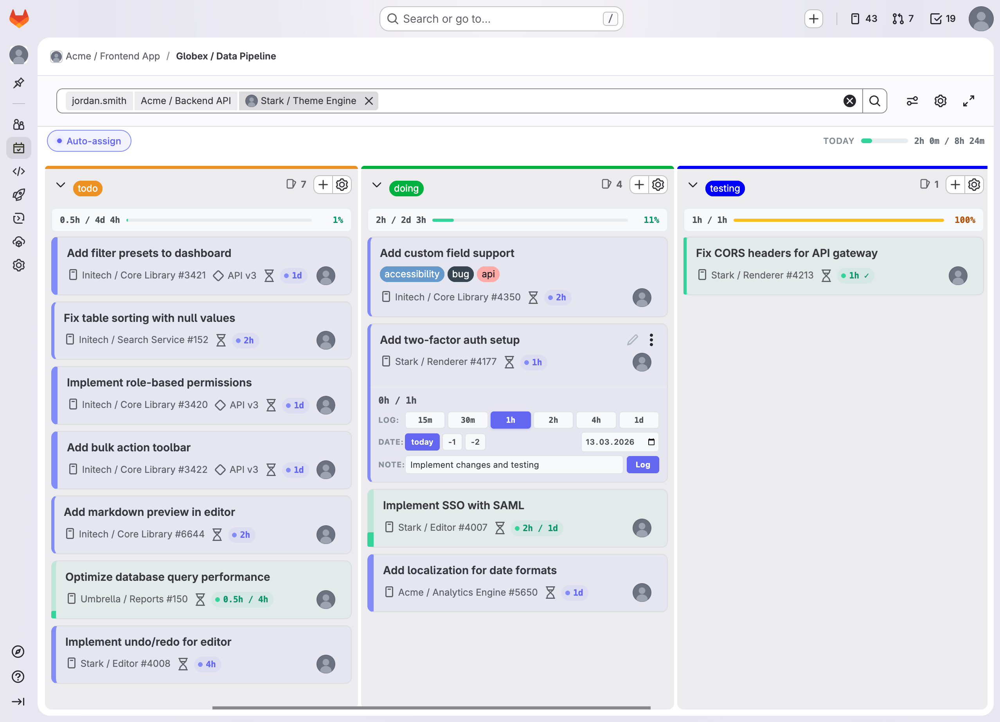
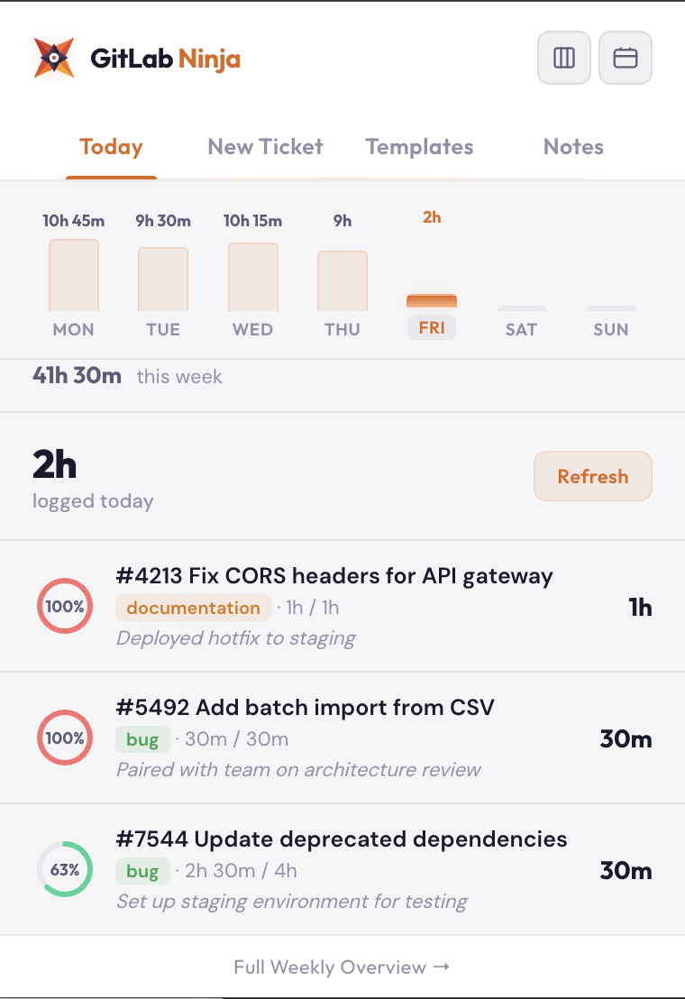
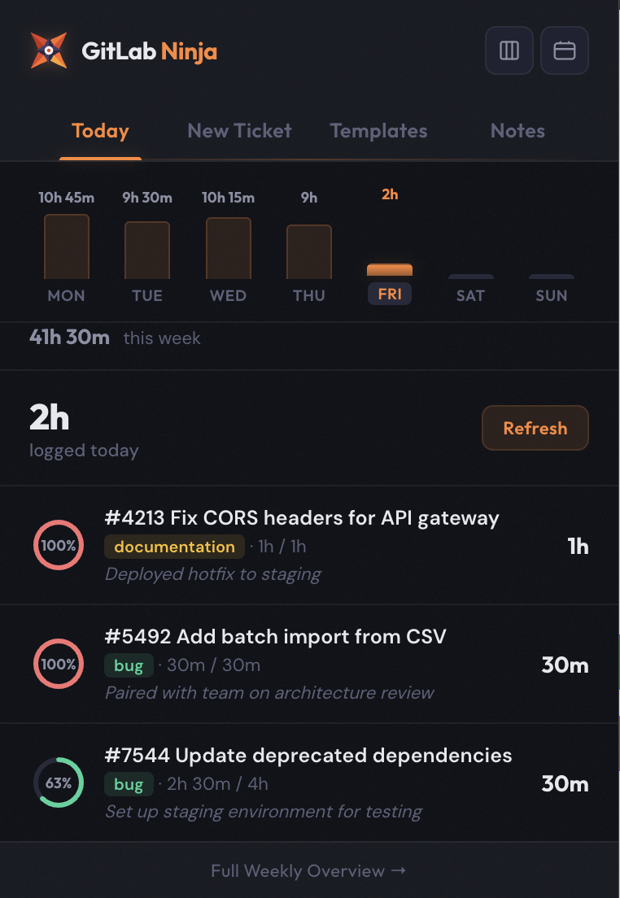
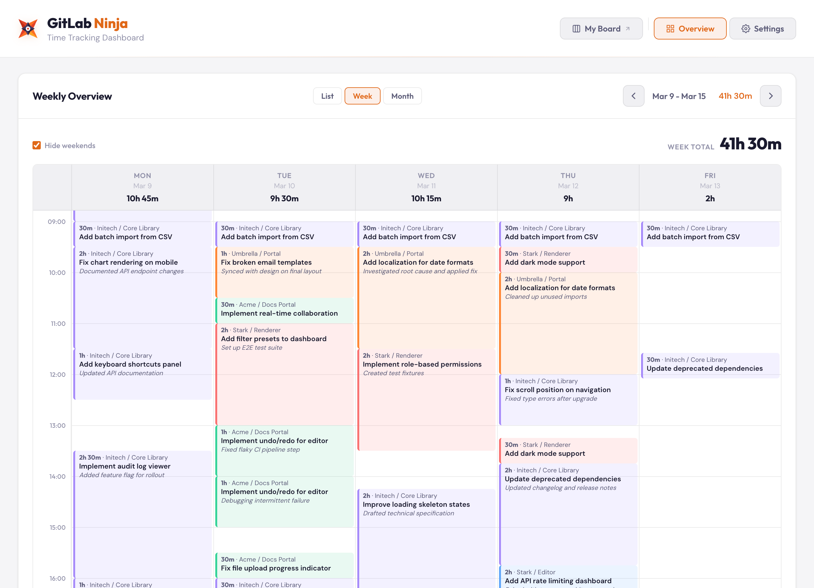
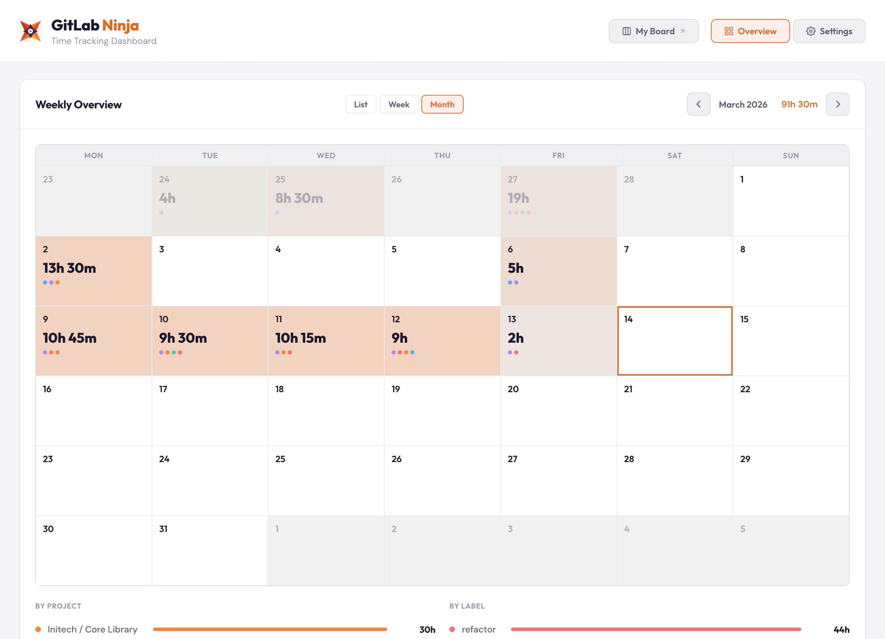
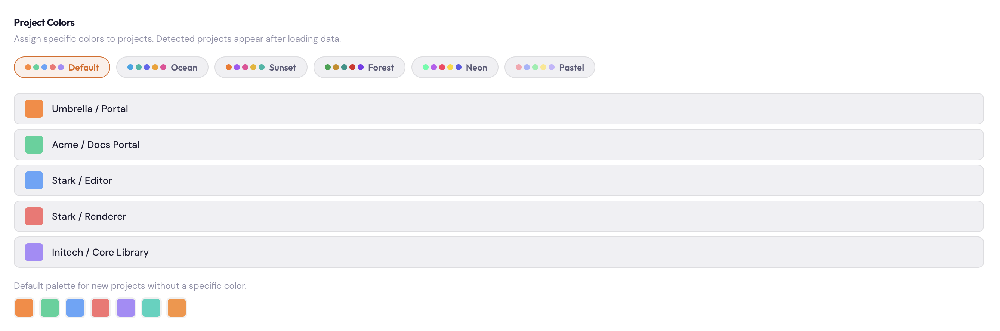
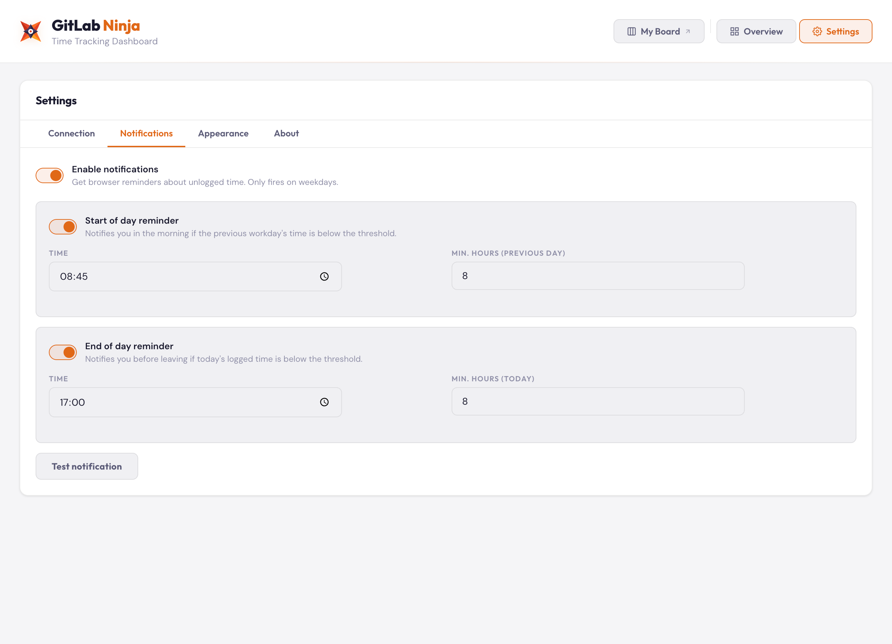

# GitLab Ninja 🥷

[](https://github.com/AndreasGassmann/gitlab-ninja/actions/workflows/ci.yml)
[](LICENSE)
[](https://github.com/AndreasGassmann/gitlab-ninja/releases)

**The missing productivity layer for GitLab boards.**

GitLab Ninja is a browser extension that transforms your GitLab boards into a time-tracking powerhouse. See time estimates at a glance, set them in one click, auto-assign issues, and never lose track of your team's budget — all without leaving the board.

> Zero data collection. Zero external servers. Your data stays in your browser.

---

## Screenshots

### Enhanced Board View — Time tracking badges on every card



### Quick Issue Creation — Create issues directly from the board



### Quick Time Logging — Log time without leaving the board



### Today Dashboard — See time logged today

<p>
  
  &nbsp;
  
</p>

### Weekly Overview — Track hours across all your projects



### Calendar View — Monthly bird's-eye view of logged time



### Project Colors — Assign colors to your projects



### Smart Notifications — Never forget to log your hours



---

## Features

### ⏱️ Time Tracking Display

Color-coded badges appear directly on every issue card showing **spent / estimate** (e.g. `2h / 4h`). Blue means on track. Red means over budget. Supports hours, days, weeks, and minutes.

### ⚡ Quick Estimates

Hover over any card to reveal one-click estimate buttons — **1h**, **2h**, **4h**, **1d**. Set estimates without ever opening the issue.

### 📊 Column Summaries

Each board column gets a live summary showing total spent vs. total estimated. A ⚠️ warning appears when a column goes over budget. Updates instantly as you drag issues around.

### 🎯 Auto-Assignment

Create an issue inline on the board and it's automatically assigned to you. No more forgetting to set the assignee.

### 🧮 Time Estimate Modal

A dedicated modal to set precise time estimates on any issue, right from the board view.

### ⚙️ Board Settings

Per-board settings panel lets you toggle individual features on or off. Your preferences are saved per board.

### 🎨 Theme-Aware

Automatically adapts to your GitLab light or dark theme.

---

## Compatibility

| Platform | Support |
|---|---|
| GitLab.com | ✅ |
| Self-hosted GitLab | ✅ |
| Chrome / Edge / Brave | ✅ |
| Firefox | ✅ |
| Safari | ✅ (via converter) |

---

## Quick Start

### Install from Source

```bash
git clone https://github.com/AndreasGassmann/gitlab-ninja.git
cd gitlab-ninja
npm install
npm run build
```

### Load in Chrome

1. Go to `chrome://extensions/`
2. Enable **Developer mode** (top right)
3. Click **Load unpacked** → select the `dist/` folder

### Load in Firefox

1. Go to `about:debugging#/runtime/this-firefox`
2. Click **Load Temporary Add-on** → select `dist/manifest_firefox.json`

### Configure

1. Click the 🥷 icon in your toolbar
2. Go to **Settings** and enter your GitLab URL + Personal Access Token
3. Navigate to any GitLab board — features activate automatically

---

## Usage

Once installed, just open any GitLab board. GitLab Ninja enhances it automatically:

- **Time badges** appear on every issue card
- **Estimate buttons** show on hover
- **Column totals** appear at the top of each list
- **New issues** are auto-assigned to you
- **Board settings** gear icon lets you toggle features per board

---

## Development

### Prerequisites

- Node.js 24+
- npm

### Commands

| Command | Description |
|---|---|
| `npm run dev` | Watch mode — rebuilds on file changes |
| `npm run build` | Production build to `dist/` |
| `npm run lint` | ESLint check |
| `npm run format` | Prettier auto-format |
| `npm run format:check` | Prettier check |
| `npm run type-check` | TypeScript type validation |
| `npm run package:all` | Package for Chrome, Firefox, and Safari |
| `npm run clean` | Remove `dist/` |

### Building for Distribution

```bash
npm run build
npm run package:all
```

Creates:
- `gitlab-ninja-chrome-v1.0.0.zip`
- `gitlab-ninja-firefox-v1.0.0.zip`
- `gitlab-ninja-safari-v1.0.0.zip`

See [DEVELOPMENT.md](DEVELOPMENT.md) for architecture overview, feature module pattern, and debugging tips.

---

## Project Structure

```
gitlab-ninja/
├── src/
│   ├── content.ts                 # Content script — main entry point
│   ├── injected.ts                # Page-context script (fetch interception)
│   ├── popup.ts                   # Extension popup UI
│   ├── popup.html
│   ├── options.ts                 # Settings page
│   ├── options.html
│   ├── background.ts              # Service worker (alarms, notifications)
│   ├── types.ts                   # Shared TypeScript types
│   ├── styles.css                 # Injected styles
│   ├── features/
│   │   ├── autoAssign.ts          # Auto-assignment on issue creation
│   │   ├── timeTracking.ts        # Time tracking badge display
│   │   ├── columnSummary.ts       # Column time totals
│   │   ├── timeEstimateModal.ts   # Estimate modal UI
│   │   ├── newIssueEstimate.ts    # Estimate for newly created issues
│   │   ├── editMode.ts            # Board edit mode enhancements
│   │   └── boardSettings.ts       # Per-board settings panel
│   └── utils/
│       ├── api.ts                 # API request helpers
│       ├── gitlabApi.ts           # GitLab REST/GraphQL API client
│       ├── apiFallback.ts         # API fallback strategies
│       ├── time.ts                # Time parsing & formatting
│       ├── dom.ts                 # DOM utilities
│       ├── constants.ts           # Shared constants
│       └── themeManager.ts        # Light/dark theme detection
├── manifests/                     # Browser-specific manifests
│   ├── manifest.json              # Chrome (MV3)
│   ├── manifest_firefox.json      # Firefox (MV2)
│   └── manifest_safari.json       # Safari
├── icons/                         # Extension icons (16, 48, 128px)
├── scripts/
│   └── package.sh                 # Packaging script for all browsers
├── store/                         # Store listing assets
├── webpack.config.js
├── tsconfig.json
└── package.json
```

---

## Troubleshooting

**Extension not activating?**
1. Confirm you're on a board page (URL contains `/boards`)
2. Check the browser console for "GitLab Ninja" log messages
3. Verify your GitLab URL is configured in Settings
4. Try refreshing the page

**Build errors?**
```bash
npm run clean && npm install && npm run build
```

---

## Contributing

Contributions are welcome! Please read [CONTRIBUTING.md](CONTRIBUTING.md) before getting started.

1. Fork the repo
2. Create a feature branch from `main`
3. Run `npm run lint && npm run type-check && npm run build`
4. Test in both Chrome and Firefox
5. Open a pull request

---

## Privacy

GitLab Ninja collects **zero data**. No analytics, no telemetry, no external servers. Your API token and settings are stored locally in your browser. API requests go only to your own GitLab instance. See the full [Privacy Policy](store/privacy-policy.md).

---

## License

[MIT](LICENSE) — use it, fork it, make it your own.
